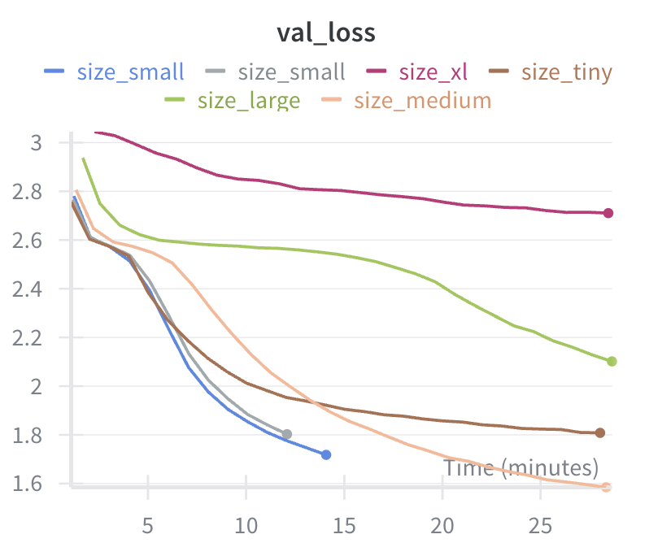
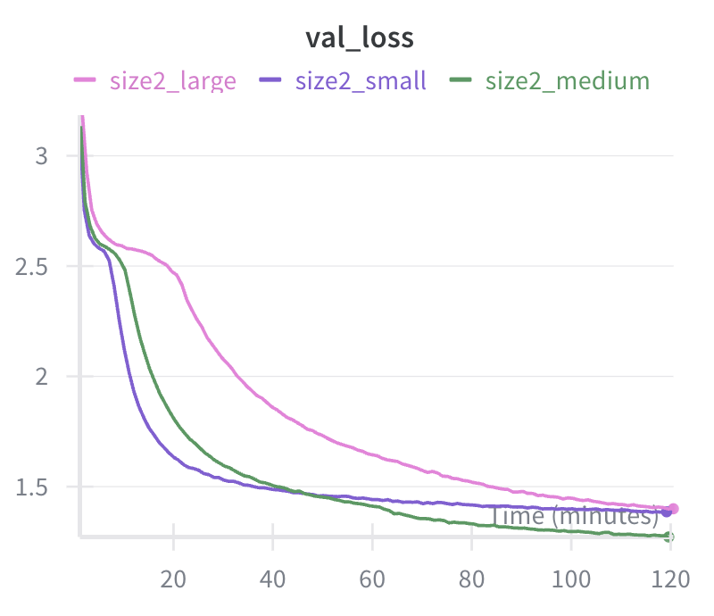
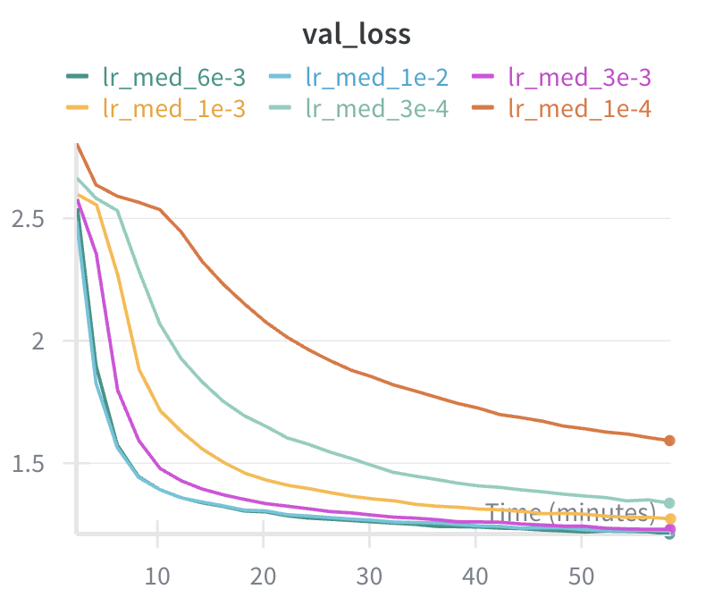
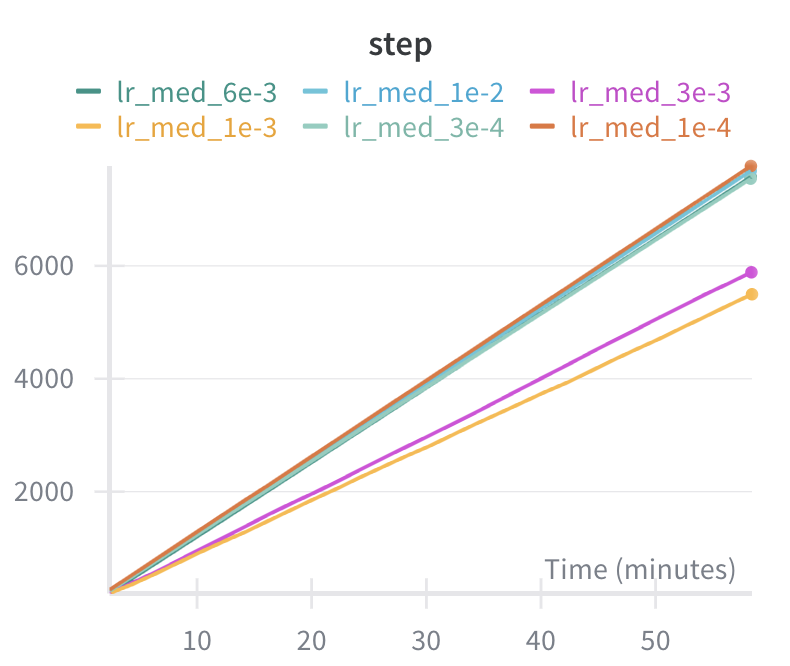
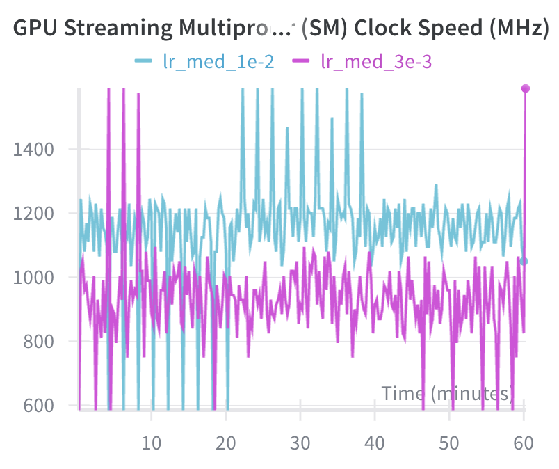
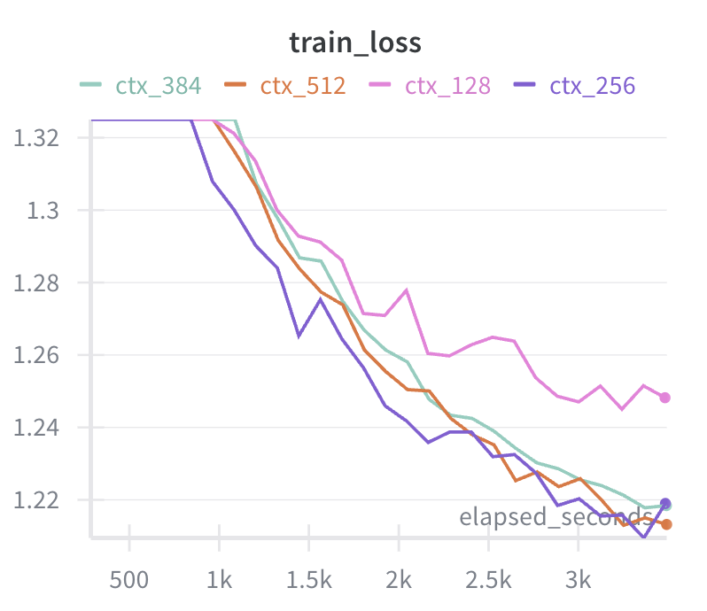
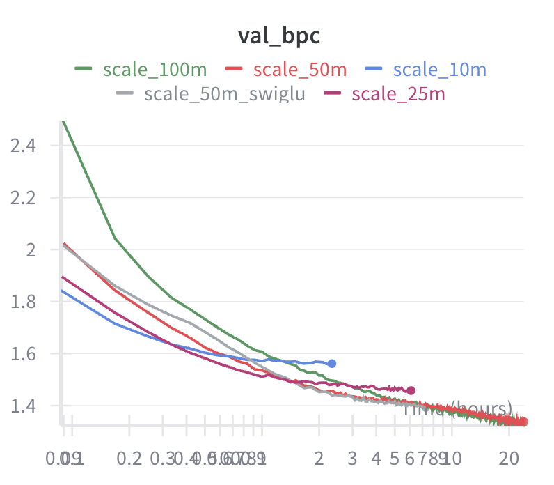

# Pretraining Experiments
Pretraining tiny models on Urban Dictionary dataset to learn about PT.

# Files
Exploration and data prep are in 00_* through 04_*.

model.py: Contains the actual transformer
train.py: modal launch script for training runs

# Experiments

## 1: torch.compile
On a tiny model, compilation had 20s overhead and ran 20% faster. Will be worth it for all non-trivial models!

## 2: Model Size, training speed, and final val loss

**Question:** How does model size affect training speed and final loss, given equal wall-clock training time?

**Varied params:**
| Name   | n_embed | heads | layers | ~Params |
|--------|---------|-------|--------|---------|
| tiny   | 64      | 4     | 2      | 130K    |
| small  | 128     | 4     | 4      | 850K    |
| medium | 256     | 8     | 6      | 5M      |
| large  | 384     | 12    | 8      | 14M     |
| xl     | 512     | 16    | 10     | 31M     |

**Held constant:**
- block_size=512, batch_size=64, dropout=0.2, ff_ratio=4
- lr=3e-4 with 10% warmup
- Training time: 30 min each
- GPU: T4

**Results:**
order of runs from lowest loss to highest loss:
1. medium
2. small (even though it only ran 1/2 the time, and might have been on track to beat medium),
3. tiny (looks like it's flatlined),
4. large (going down steeply!),
5. xl (loss is much higher than the rest and quite flat)



## 3: Repeat of size experiment with 2 hrs

**Varied params:**
| Name   | n_embed | heads | layers | ~Params |
|--------|---------|-------|--------|---------|
| small  | 128     | 4     | 4      | 850K    |
| medium | 256     | 8     | 6      | 5M      |
| large  | 384     | 12    | 8      | 14M     |


**Results**
small initially was lowest loss, but then at 45 min medium surpassed it, and at 2 hours large almost tied small.
final losses:                                         
small: 1.38
medium: 1.27
large: 1.4



I think medium is going to be my experiment workhorse.


## 4: Learning Rate Experiment for Medium model

**Medium Model params:**
| Name   | n_embed | heads | layers | ~Params |
|--------|---------|-------|--------|---------|
| medium | 256     | 8     | 6      | 5M      |

**Held constant:**
- block_size=512, batch_size=64, dropout=0.05, ff_ratio=4
- Training time: 60 min each
- GPU: T4


| Run Name | Params | Steps | Val Loss |
|----------|--------|-------|----------|
| lr_med_1e-2 | 4,913,758 | 7,937 | 1.2181 |
| lr_med_6e-3 | 4,913,758 | 7,825 | 1.2132 |
| lr_med_3e-3 | 4,913,758 | 6,068 | 1.2284 |
| lr_med_1e-3 | 4,913,758 | 5,638 | 1.2674 |
| lr_med_3e-4 | 4,913,758 | 7,797 | 1.3365 |
| lr_med_1e-4 | 4,913,758 | 8,026 | 1.5870 |

**Result**
6e-3 was the winner, but barely any difference to the more standard 3e-3.



**Inconsistent Step speed Mystery**
Two of the runs stepped slower, even though everything should have been identical.



Because it was the two middle learning rates that ran slower, the most likely cause is inconsistent hardware on Modal.

Investigating the slow runs on wandb, I can clearly see that they had lower `GPU Streaming Multiprocessor (SM) Clock Speed (MHz)` (smoking gun) and also different `Process Memory Available (MB)` (not important, but clear sign these runs were on different heterogeneous machines).



For any experiments that should be iso-compute I can just run based on number of steps, but for comparing across sizes, this will be trickier. I also checked my size experiments and there was +/- 10% clock speed, but not enough to make a serious difference.

## 5: Batch Size + LR Scaling

**Question:** What batch size trains fastest for the medium model? Does sqrt-scaled LR work, or does batch_256 need a different LR?

**Model:** medium (5M params)

**Varied params:**
| Batch Size | Learning Rate | Notes                        | Val Loss |
|------------|---------------|------------------------------|----------|
| 64         | 3e-3          | baseline                     | 1.210    |
| 128        | 4.2e-3        | 3e-3 × √2                    | 1.210    |
| 256        | 3e-3          | no LR scaling                | 1.288    |
| 256        | 6e-3          | 3e-3 × √4 (sqrt scaling)     | 1.251    |
| 256        | 9e-3          | 1.5x sqrt scaling            | 1.228    |
| 256        | 1.2e-2        | linear scaling               | 1.243    |
| 512        | 8.5e-3        | OOM                          | -        |

**Held constant:**
- block_size=512, dropout=0.05, ff_ratio=4
- Training time: 60 min each
- GPU: T4
- Only eval on train set during training (val at end) to reduce overhead

**Results:**

batch_64 and batch_128 tied at 1.210 — doubling batch size with sqrt-scaled LR gives identical results.

batch_256's best LR was 9e-3 (between sqrt and linear scaling), but still slightly worse at 1.228.

**Conclusion:** For this 5M model, we hit diminishing returns around batch_128. Larger batches don't improve training speed — likely hitting the critical batch size. Stick with batch_64 or batch_128.

## 6: Context Length

**Question:** Can we train faster with shorter context? The current block_size=512 might be overkill for Urban Dictionary entries.

**Data analysis:**
```
Length distribution (characters per entry):
  Median: 122
  75th:   214
  90th:   370
  95th:   529

Entries fitting in each block_size:
  block_size=128: 52.5%
  block_size=256: 81.1%
  block_size=384: 90.7%
  block_size=512: 94.7%
```

**Model:** medium (5M params)

**Varied params:**
| block_size | % entries fit | Expected speedup |
|------------|---------------|------------------|
| 128        | 52.5%         | ~4x faster steps |
| 256        | 81.1%         | ~2x faster steps |
| 384        | 90.7%         | ~1.3x faster     |
| 512        | 94.7%         | baseline         |

**Held constant:**
- batch_size=64, lr=3e-3, dropout=0.05, ff_ratio=4
- Training time: 60 min each
- GPU: T4

**Note:** Current batching picks random positions in the corpus stream, not aligned to entry boundaries. Windows typically span 2+ entries. The "% entries fit" is about single-entry containment, not actual training windows.

**Results:**
| block_size | Steps | Chars/hr | Val Loss |
|------------|-------|----------|----------|
| 128        | 41,757 | 342M    | 1.2451   |
| 256        | 19,814 | 325M    | 1.2136   |
| 384        | 9,428  | 232M    | 1.2191   |
| 512        | 8,120  | 266M    | 1.2135   |



**Conclusions:**
- ctx_256 and ctx_512 tie on final loss — no training speed advantage either way
- ctx_256 sees 22% more characters/hr but needs more steps to reach same loss
- ctx_128 is too aggressive — truncation hurts more than extra data helps
- Sticking with block_size=256 for future experiments (lower memory, same quality)

## 7: Tokenization — Char-level vs GPT-2 Tiktoken

**Question:** Does subword tokenization beat char-level at equal parameter count and training time?

**Metric: Bits Per Character (BPC)**

Cross-entropy loss measures bits per token, but tokens have different granularities. BPC normalizes to bits per character for fair comparison:

```
BPC = loss / (chars_per_token * ln(2))
```

- Char-level: `chars_per_token = 1.0`
- GPT-2 tiktoken: `chars_per_token ≈ 4.11`

**Corpus stats:**
- 479M chars → 117M GPT-2 tokens
- 4.11 chars/token compression
- 97% of GPT-2 vocab used (48,826 / 50,257)

**Baseline (char-level):**
| Run | Tokenizer | n_embed | heads | layers | block_size | Params | Val Loss | BPC |
|-----|-----------|---------|-------|--------|------------|--------|----------|-----|
| medium | char | 256 | 8 | 6 | 256 | 5M | 1.21 | 1.75 |

**Target to beat: 1.75 BPC**

**GPT-2 Tiktoken Sweep:**

All runs use `tie_weights=True` — shares embedding and lm_head weights. Critical for large vocab: with 50K vocab and n_embed=80, embedding alone is 4M params. Tying cuts that in half.
| Run         | n_embed | heads | layers | block_size | ~Params | Notes                          |
|-------------|---------|-------|--------|------------|---------|--------------------------------|
| gpt2_5m     | 80      | 4     | 10     | 64         | 4.9M    | Match ~5M param count          |
| gpt2_wide   | 96      | 6     | 6      | 64         | 5.6M    | Wider, shallower               |
| gpt2_ctx128 | 72      | 4     | 8      | 128        | 4.2M    | 2x context (512 chars effective) |
| gpt2_deep   | 64      | 4     | 12     | 64         | 3.9M    | Deep & narrow                  |
| gpt2_ctx256 | 64      | 4     | 8      | 256        | 3.7M    | 4x context (1K chars effective) |
| gpt2_small  | 48      | 4     | 6      | 128        | 2.6M    | Smallest model                 |
| gpt2_6m     | 104     | 4     | 8      | 128        | 6.3M    | Larger than baseline           |
| gpt2_8m     | 128     | 8     | 8      | 128        | 8.1M    | Largest model                  |

**Held constant:**
- batch_size=64, lr=3e-3, dropout=0.05, ff_ratio=4
- Training time: 60 min each
- GPU: T4

**Success criteria:**
- GPT-2 wins if any run achieves < 1.75 BPC
- Char-level wins if all GPT-2 runs >= 1.75 BPC

**Results:**

| Run         | Params | Steps  | Train BPC | Val BPC   | vs 1.75 |
|-------------|--------|--------|-----------|-----------|---------|
| gpt2_8m     | 8.1M   | 18,359 | 1.641     | **1.658** | -5.3%   |
| gpt2_6m     | 6.3M   | 20,442 | 1.662     | **1.674** | -4.4%   |
| gpt2_wide   | 5.6M   | 44,174 | 1.676     | **1.686** | -3.7%   |
| gpt2_5m     | 4.9M   | 43,617 | 1.682     | **1.687** | -3.6%   |
| gpt2_deep   | 3.9M   | 54,167 | 1.702     | **1.720** | -1.7%   |
| gpt2_ctx128 | 4.2M   | 22,423 | 1.724     | **1.725** | -1.5%   |
| gpt2_ctx256 | 3.7M   | 12,405 | 1.770     | 1.772     | +1.3%   |
| gpt2_small  | 2.6M   | 31,443 | 1.783     | 1.790     | +2.3%   |

**Winner: GPT-2 tiktoken** — 6 of 8 configs beat the 1.75 BPC char-level baseline.

**Observations:**
- **More params help** — larger models beat baseline despite 50K vocab embedding overhead
- **Short context wins** — block_size=64 beats 128/256 at similar param counts; small models can't use long context effectively
- **Depth helps** — gpt2_deep (12 layers) beats gpt2_ctx128 (8 layers) despite fewer params
- **Throughput tradeoff** — short-context models got 2-4x more steps in the same hour

---

### Small-Vocab BPE Experiment

**Question:** Can small-vocab BPE get compression benefits without the embedding overhead of GPT-2's 50K vocab?

Trained custom BPE tokenizers on the corpus:
- **bpe500**: 500 vocab, 2.25 chars/token compression
- **bpe1k**: 1000 vocab, 2.64 chars/token compression

With tiny vocab, embedding overhead is negligible → can use large n_embed (256-320) like char-level.

Block sizes chosen to match ~256 char effective context:
- bpe500: block_size=112 → 252 chars
- bpe1k: block_size=96 → 253 chars
| Run          | Vocab | n_embed | layers | block_size | Params | Train BPC | Val BPC   | vs 1.75 |
|--------------|-------|---------|--------|------------|--------|-----------|-----------|---------|
| bpe1k_match  | 1000  | 256     | 6      | 96         | 5.0M   | 1.666     | **1.675** | -4.3%   |
| bpe500_wide  | 500   | 320     | 6      | 112        | 7.6M   | 1.679     | **1.681** | -3.9%   |
| bpe500_deep  | 500   | 256     | 8      | 112        | 6.5M   | 1.677     | **1.683** | -3.8%   |
| bpe500_match | 500   | 256     | 6      | 112        | 4.9M   | 1.680     | **1.687** | -3.6%   |
| bpe1k_wide   | 1000  | 320     | 6      | 96         | 7.7M   | 1.658     | (timeout) | —       |

**Result:** bpe1k_match (5M params, 1.675 val BPC) is close to gpt2_8m (8.1M params, 1.658 val BPC)

**Qualitative Generation Results**
From reading some of the outputs, i think the tiktoken runs produced the best outputs. I trust that more than the BPC comparisons for my purposes!

## 8: 24hr Scaling Run — 10M to 100M

**Question:** How far can we scale with 24hr of A10G compute? What's the best model size for this budget?

Based on learnings from experiments 1-7, consolidated best practices into a single large-scale run.

**Architecture choices (from prior experiments):**
- Tiktoken tokenizer (exp 7: beat char-level)
- tie_weights=True (critical for 50K vocab)
- block_size=64 tokens (~260 chars, covers median entry)
- batch_size=64 (exp 5: at critical batch size)
- GPT-2-style depth/width ratios (d_model/n_layers ≈ 50-80)
- GELU activation (switched from ReLU)
- dropout=0.1 (increased for multi-epoch training)

**Training setup:**
- LR: scaled by 1/√(params) from 5M baseline
- LR schedule: 2000 step linear warmup → cosine decay to 10% of peak
- GPU: A10G (~2x faster than T4)
- TF32 matmul precision enabled
- Training time: 24hr each
- Atomic checkpoints for preemption safety

**Model configs:**
| Run | n_embed | heads | layers | ~Params | d/L ratio | LR |
|-----|---------|-------|--------|---------|-----------|------|
| scale_10m | 192 | 3 | 4 | 11M | 48 | 3e-3 |
| scale_25m | 320 | 5 | 6 | 23M | 53 | 2e-3 |
| scale_50m | 512 | 8 | 8 | 51M | 64 | 1.5e-3 |
| scale_100m | 768 | 12 | 10 | 109M | 77 | 1e-3 |
| scale_50m_swiglu | 512 | 8 | 8 | ~51M | 64 | 1.5e-3 |

All have 64 dim per head (matching GPT-2). The 50M config matches GPT-2 Small proportions scaled down.

**SwiGLU variant:** Same as scale_50m but using SwiGLU FFN (LLaMA-style) instead of GELU. Uses 8/3 expansion ratio to match parameter count.

**Expected epochs (with A10G speeds):**
| Run | Est. steps/hr | Est. epochs |
|-----|---------------|-------------|
| scale_10m | ~35,000 | ~30 |
| scale_25m | ~20,000 | ~17 |
| scale_50m | ~12,000 | ~10 |
| scale_100m | ~7,000 | ~6 |

**Results:**

| Run | Params | Val BPC | Time | Notes |
|-----|--------|---------|------|-------|
| scale_100m | 109M | **1.33** | 24hr | Best overall |
| scale_50m | 51M | **1.34** | 24hr | Nearly tied 100m |
| scale_50m_swiglu | 51M | ~1.34 | 7hr (paused) | Identical to GELU, stopped early |
| scale_25m | 23M | 1.46 | 6hr (paused) | Plateaued, stopped early |
| scale_10m | 11M | 1.56 | 2.3hr (paused) | Plateaued quickly |

**Observations:**
- **100m barely beats 50m** — only 0.01 BPC difference despite 2x params. 50m is more compute-efficient for this budget.
- **SwiGLU ≈ GELU** — no measurable difference at 50M scale; GELU is simpler.
- **Smaller models plateau early** — 10m and 25m overtrained (too many epochs on limited data). Correctly predicted from epoch estimates.
- **Best result: 1.33 BPC** — down from 1.66 BPC (gpt2_8m in exp 7), a 20% improvement from scaling 8M → 100M.

**Conclusion:** For 24hr A10G budget on this dataset, 50M is the sweet spot. Larger models give diminishing returns; smaller models overtrain.


